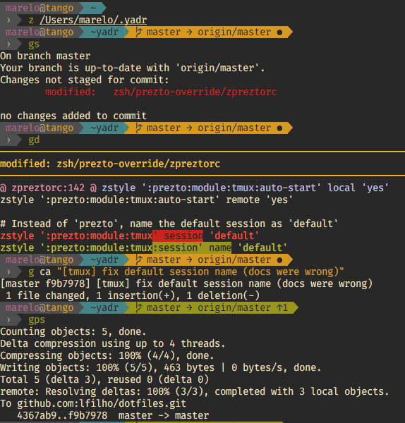

     _     _           _
    | |   | |         | |
    | |___| |_____  __| | ____     Yet Another Dotfile Repo
    |_____  (____ |/ _  |/ ___)
     _____| / ___ ( (_| | |        @lfilho's Version
    (_______\_____|\____|_|

&nbsp;&nbsp;&nbsp;&nbsp;&nbsp;&nbsp;&nbsp;&nbsp;&nbsp;&nbsp;&nbsp;&nbsp;&nbsp;&nbsp;&nbsp;&nbsp;&nbsp;&nbsp;&nbsp;&nbsp;&nbsp;&nbsp;&nbsp;&nbsp;&nbsp;&nbsp;&nbsp;&nbsp;&nbsp;&nbsp;&nbsp;&nbsp;&nbsp;&nbsp;&nbsp;&nbsp;&nbsp;&nbsp;&nbsp;&nbsp;&nbsp;&nbsp;&nbsp;&nbsp;&nbsp;&nbsp;&nbsp;&nbsp;&nbsp;&nbsp;&nbsp;&nbsp;[](https://travis-ci.org/lfilho/dotfiles)&nbsp;![PRs Welcome][prs-badge]&nbsp;![macos supported][apple-logo]&nbsp;![linux supported][linux-logo]


```bash
sh -c "`curl -fsSL https://raw.githubusercontent.com/lfilho/dotfiles/master/install.sh`"
```

---
<!-- START doctoc generated TOC please keep comment here to allow auto update -->
<!-- DON'T EDIT THIS SECTION, INSTEAD RE-RUN doctoc TO UPDATE -->
Table of Contents:

- [Installation](#installation)
  - [One liner for OSX](#one-liner-for-osx)
  - [Instructions for Linux](#instructions-for-linux)
  - [Wait, you're not done!](#wait-youre-not-done)
- [Upgrading](#upgrading)
- [What is YADR?](#what-is-yadr)
- [What is (this fork's version of) YADR?](#what-is-this-forks-version-of-yadr)
- [What's included, how to learn, how to customize?](#whats-included-how-to-learn-how-to-customize)
- [Docker Support](#docker-support)
- [Testing](#testing)
- [Screenshot](#screenshot)
- [Vimization of everything](#vimization-of-everything)
- [OSX](#osx)
- [Credits](#credits)

<!-- END doctoc generated TOC please keep comment here to allow auto update -->

---

## Installation

### One liner for OSX

To get started please run:

```bash
sh -c "`curl -fsSL https://raw.githubusercontent.com/lfilho/dotfiles/master/install.sh`"
```

**Note:** YADR will automatically install all of its subcomponents. If you want to be asked about each one, use:

```bash
sh -c "`curl -fsSL https://raw.githubusercontent.com/lfilho/dotfiles/master/install.sh`" -s ask
```
### Instructions for Linux

*Please do help us improving Linux support in this repo ;-)*

1. Make sure you have `zsh` installed on your machine (default location is `/bin/zsh`). Type `zsh --version` to see if you have it. If not, install it running the command `sudo apt-get install zsh`
2. Make sure you have `vim` installed. If not, install it with `sudo apt-get install vim`
3. Run the one liner installation script (see OSX section above)
4. If asked, provide your superuser password
5. Configure your terminal program to point the command to zsh (default `/bin/zsh`)
6. Restart you Terminal
7. You're done.

*TIP*: You can check the [`Dockerfile`](./Dockerfile) to see what's need for a basic installation.

### Wait, you're not done!

Remap <kbd>caps-lock</kbd> to <kbd>esc</kbd>!

The <kbd>esc</kbd> key is the single most used key in vim. Old keyboards used to have <kbd>Esc</kbd> where Tab is today. Apple keyboards are the worst with their tiny <kbd>Esc</kbd> keys. But all this is fixed by remapping Caps to <kbd>Esc</kbd>. If you're hitting a small target in the corner, you are slowing yourself down considerably, and probably damaging your hands with repetitive strain injuries.

**For OSX**: with [Seil](https://pqrs.org/osx/karabiner/seil.html.en)

**For Ubuntu**: `dconf write /org/gnome/desktop/input-sources/xkb-options "['caps:swapescape']"`

**TODO / IDEA**: Would be nice if anyone knows a way of automating this step.

## Upgrading

Upgrading is easy.

```bash
cd ~/.yadr
git pull --rebase
rake update
```

## What is YADR?

**YADR is an opinionated dotfile repo that will make your heart sing**

  * The best bits of all the top dotfile repos, vim and zsh plugins curated in one place, into a simple and cohesive way of working.
  * Several vim plugins, all under one roof, working together, each plugin researched and configured to be at its best, often with better shortcut keys.
  * Many zsh plugins, starting with the wonderful Prezto base, and adding a few niceties on top.
  * All things are vimized: command line, irb, postgres command line, tmux, etc.

## What is (this fork's version of) YADR?

This is @lfilho's fork of the great work done by Yan (@skwp), [Yadr](https://github.com/skwp/dotfiles).

I've been using Yadr since 2013 but since a couple of years ago my preferences and configurations started to diverge too much from upstream. So now my repo is barely mergeable with the original one. Although I'm still a contributor there, my main focus should on my fork (unless we converge again in the future of course :-)).

Here are the differences in a nutshell (also make sure you read the [What's included, how to learn, how to customize?](#whats-included-how-to-learn-how-to-customize) section):

- NeoVim in Terminal rather than GUI MacVim
- Generally faster vim experience (mostly because of RipGrep and NeoVim's async stuff, but we also use less plugins)
- Keymaps that don't rely on MacOS's <kbd>Cmd</kbd> key, so keymaps would stay cohesive in both TUI vim, GUI vim and Linux environments.
- Testing. We have basic CI testing. See more about it in the [Testing](#testing) section.
- Different set of VIM plugins. That's too big of a list to keep up to date here in README so if you're interested you're better off comparing the two repo's plugins. What I can say is:
  - We focus less on Ruby, since it's not my most used language
  - We focus a little more on Javascript/Node
  - We focus on plugins that work better with NeoVim's better features and architecture
- Couple of new aliases for command line and also git
- Different file and folder organization and conventions for vim plugins and configurations (all contained to installation folder)
- Automated iTerm2 configuration (including themes and colors)
- Brew packages. I have added a [`Brewfile`](./Brewfile) which makes easier to mantain and more flexible for the community to customize (you can point `brew` to different Brewfiles whenever you need; also easier to customize in your own fork)
- Docker. Means you can test this repo in a Docker container without messing with your host environment until you're sure. More on that in the [Docker Support](#docker-support) section below.
- Linux support. It's still very far from ideal, but it's my intention to leave the repo working for both MacOS and Linux as well as we can. The initial effort is done via the Docker support. The community can take it from there and help improve things.
- Themes and colors. I'm not a fan of Solarized so I removed it and so far I'm enjoying Gruvbox theme (both for Vim and the terminal). I have also created my own zsh prompt. There are some screenshots in the [Screenshots](#screenshots) section below.

## What's included, how to learn, how to customize?

The best way to learn the answer the the above questions is to browse the README files in each directory (starting with this one). For example, if you're insterested in seeing which vim plugins are there, as well their keymaps, head to [nvim/README.md](./nvim/README.md) and start from there, proceeding to its subfolders' README and finally to each configuration file (there will be more specific comments inside each file).

## Docker Support

We can use Docker to test some changes in a Linux Container.

Assuming your host system has Docker & Docker Compose properly installed, run:

    docker-compose run dotfiles

This will build the container image it never built it before (which may take a while -- future times will be faster) and then run a `zsh` session inside that container for you.
There you can play around, test commands, aliases, etc.

*Warning*: this repo is primarly OSX oriented. So any support for Linux can only be done with the help of the community.

## Testing

We have a basic automated CI testing for both Linux and OSX.
Head to [test/README.md](./test/README.md) for more details.

## Screenshot

Here's how my zsh prompt looks like on iTerm:



It's using Gruvbox colors. For screenshots on how Vim looks with Gruvbox, you can check [their gallery](https://github.com/morhetz/gruvbox/wiki/Gallery) out.

## Vimization of everything

The provided inputrc and editrc will turn your various command line tools like mysql and irb into vim prompts.
There's also an included Ctrl-R reverse history search feature in editrc, very useful in irb, postgres command line, and etc.

## OSX

See [Other recommended OSX productivity tools](doc/osx_tools.md).

Also, the a osx file is a bash script that sets up sensible defaults for devs and power users under osx. Read through it before running it. To use:

    bin/osx

These hacks are Lion-centric. May not work for other OS'es. My favorite mods include:

  * Ultra fast key repeat rate (now you can scroll super quick using j/k)
  * No disk image verification (downloaded files open quicker)
  * Display the `~/Library` folder in finder (hidden in Lion)

## Credits

See [Credits & Thanks](doc/credits.md)


[apple-logo]: https://img.shields.io/badge/macos-supported-blue.svg?logo=data%3Aimage%2Fpng%3Bbase64%2CiVBORw0KGgoAAAANSUhEUgAAABEAAAAUCAYAAABroNZJAAAABGdBTUEAALGPC%2FxhBQAAACBjSFJNAAB6JgAAgIQAAPoAAACA6AAAdTAAAOpgAAA6mAAAF3CculE8AAAACXBIWXMAAAsTAAALEwEAmpwYAAACAmlUWHRYTUw6Y29tLmFkb2JlLnhtcAAAAAAAPHg6eG1wbWV0YSB4bWxuczp4PSJhZG9iZTpuczptZXRhLyIgeDp4bXB0az0iWE1QIENvcmUgNS40LjAiPgogICA8cmRmOlJERiB4bWxuczpyZGY9Imh0dHA6Ly93d3cudzMub3JnLzE5OTkvMDIvMjItcmRmLXN5bnRheC1ucyMiPgogICAgICA8cmRmOkRlc2NyaXB0aW9uIHJkZjphYm91dD0iIgogICAgICAgICAgICB4bWxuczpleGlmPSJodHRwOi8vbnMuYWRvYmUuY29tL2V4aWYvMS4wLyIKICAgICAgICAgICAgeG1sbnM6dGlmZj0iaHR0cDovL25zLmFkb2JlLmNvbS90aWZmLzEuMC8iPgogICAgICAgICA8ZXhpZjpQaXhlbFlEaW1lbnNpb24%2BNjY8L2V4aWY6UGl4ZWxZRGltZW5zaW9uPgogICAgICAgICA8ZXhpZjpQaXhlbFhEaW1lbnNpb24%2BNTU8L2V4aWY6UGl4ZWxYRGltZW5zaW9uPgogICAgICAgICA8dGlmZjpPcmllbnRhdGlvbj4xPC90aWZmOk9yaWVudGF0aW9uPgogICAgICA8L3JkZjpEZXNjcmlwdGlvbj4KICAgPC9yZGY6UkRGPgo8L3g6eG1wbWV0YT4Ktkd%2F7gAAAiNJREFUOBGNUz1rG0EQ1UnRSZiDRMYmjbqAITJJpUaV22DiXxDSmYB%2FgcH%2FJFWKNCFpTH6CW0FUBKH0EVKEkC46fZ10H%2Bv35naPUyJbWpibnTezb2dn5nK5PZZSqgDJ7xG6PYQE2z17oobA87yTxWJxOxwO3%2FKowR%2BkYYCWIoMGg8GLIAi8MAwVSOrEHiSBIw%2BxGJRdURR9Aa6gPxhcx6Y1ekIHQcuyYu6n0%2BnLUqlk%2B77fbTabDm5%2FE8fxD8dxOsDOkdFvxP7cOEcCAu12216v158RhEujJeTPfD4f9Pv9eDKZLPkcYAo6ANm3Xq93ZIiYhTwBBJ8YlBX40qXxAFkp1EiNx%2BNXmiTp3mw2e61vihHMVKhlZXCcj2GGCsW%2B0gRSDvnYtn2GdxIPIdIVaAE0zn2MfQFPcVut1i1sLqmj1APOpwm2%2B4v0lp1OZ8lInFPUpk1rGjuWhQLl0LnDRqNxzFjYUg8hAbu0DPhjI06SsFgslmu12rW%2BMAImz865rvsMBeuCjN3h2uhS1jbFXa1WNyYbTmmhUqn8hfOrYdd6q2I2LDZ0VQeIIU8ajUZVZOOCjFn4kAAik6f3tH36ETdEm5%2BTBGRJXbGRVmMy33OQEJwKDqR74rTR5gtNIOeSoiSMyNJSGLx35XL5EsRTvPsOk%2FwLc3SKrtThPwDJR%2Fi%2Fw1%2BAHZFsY8GRkm44%2FjEQZ0ZDPP8dMjdowmzLza38481eSO4BM4sOer2f%2BQ4AAAAASUVORK5CYII%3D

[linux-logo]: https://img.shields.io/badge/linux-supported-blue.svg?logo=data%3Aimage%2Fpng%3Bbase64%2CiVBORw0KGgoAAAANSUhEUgAAABAAAAAUCAQAAAAua3X8AAAABGdBTUEAALGPC%2FxhBQAAACBjSFJNAAB6JgAAgIQAAPoAAACA6AAAdTAAAOpgAAA6mAAAF3CculE8AAAACXBIWXMAAAsTAAALEwEAmpwYAAACAmlUWHRYTUw6Y29tLmFkb2JlLnhtcAAAAAAAPHg6eG1wbWV0YSB4bWxuczp4PSJhZG9iZTpuczptZXRhLyIgeDp4bXB0az0iWE1QIENvcmUgNS40LjAiPgogICA8cmRmOlJERiB4bWxuczpyZGY9Imh0dHA6Ly93d3cudzMub3JnLzE5OTkvMDIvMjItcmRmLXN5bnRheC1ucyMiPgogICAgICA8cmRmOkRlc2NyaXB0aW9uIHJkZjphYm91dD0iIgogICAgICAgICAgICB4bWxuczpleGlmPSJodHRwOi8vbnMuYWRvYmUuY29tL2V4aWYvMS4wLyIKICAgICAgICAgICAgeG1sbnM6dGlmZj0iaHR0cDovL25zLmFkb2JlLmNvbS90aWZmLzEuMC8iPgogICAgICAgICA8ZXhpZjpQaXhlbFlEaW1lbnNpb24%2BNjc8L2V4aWY6UGl4ZWxZRGltZW5zaW9uPgogICAgICAgICA8ZXhpZjpQaXhlbFhEaW1lbnNpb24%2BNTQ8L2V4aWY6UGl4ZWxYRGltZW5zaW9uPgogICAgICAgICA8dGlmZjpPcmllbnRhdGlvbj4xPC90aWZmOk9yaWVudGF0aW9uPgogICAgICA8L3JkZjpEZXNjcmlwdGlvbj4KICAgPC9yZGY6UkRGPgo8L3g6eG1wbWV0YT4KcLJ2GgAAAcxJREFUGBllwU1I02EcwPHv83se3dCckcOXxRQlxKRBmaBR4MjOBQWG125FFOJB6NQLFBRd6hiEZyGhIDpECRZRhNBBoRcKmZfKynAbbv6359f21xHR58Nfatimwv%2FUwMpQ8VJ2TOtBhX%2BphdWRTfVa0NW5r42ghpCwxYCezFHeyAQN6abTgCUkbPHwI%2FmeTN1zVqgbAJSQUGWMh%2FyOF1zAmhhBF6CEhJro554mkiYjedaGx%2BPGq1AhVMwIDCWlK8WYfJRXpdb4%2BYuApUYdZG7d177gmPbruA80W3o4CDOWKrUwu3dj87L2l9N6VAd0Nijqt5dUqBFCh859qHsUxMXjCXjtNsuRw0ujgBUVU77eEju1RME6qiKsUlClLU2FLFjoPVHq%2BFRChCpLjjWiNCUBL4MBPJ04Q8p0k8XhaWQPu8lzI0H9FXEwdWdx32LpoLvLJN8BhzJhlulpVmuc%2FZl8Nr3gOv0bc8Bk9W3Z%2BuM%2BwQPJkWvPtM89cbsibdECeRfovdI1l3bNDDPNuj8izjnMhk2vt7%2FbX%2B5uaY11SrRoHv%2BeX%2F6S6NjZ0Od%2FXb05Sc1U8%2Fzo7bOkCOUTOjLaS5UB5hzCNhW1KoRUMPAHBgywCw3JeWgAAAAASUVORK5CYII%3D

[prs-badge]: https://img.shields.io/badge/PRs-welcome-brightgreen.svg?style=flat&logo=data%3Aimage%2Fpng%3Bbase64%2CiVBORw0KGgoAAAANSUhEUgAAACAAAAAgCAMAAABEpIrGAAACWFBMVEXXWkrXWkrXWkrXWkrXWkrXWkrXWkrXWkrXWkrXWkrXWkrXWkrXWkrXWkrXWkrXWkrXWkrXWkrXWkrXWkrXWkrXWkrXWkrXWkrXWkrXWkrXWkrXWkrXWkrXWkrXWkrXWkrXWkrXWkrXWkrXWkrXWkrXWkrXWkrXWkrXWkrXWkrXWkrXWkrXWkrXWkrXWkrXWkrXWkrXWkrXWkrXWkrXWkrXWkrXWkrXWkrXWkrXWkrXWkrXWkrXWkrXWkrXWkrXWkrXWkrXWkrXWkrXWkrXWkrXWkrXWkrXWkrXWkrXWkrXWkrXWkrXWkrXWkrXWkrXWkrXWkrXWkrXWkrXWkrXWkrXWkrXWkrXWkrXWkrXWkrXWkrXWkrXWkrXWkrXWkrXWkrXWkrXWkrXWkrXWkrXWkrXWkrXWkrXWkrXWkrXWkrXWkrXWkrXWkrXWkrXWkrXWkrXWkrXWkrXWkrXWkrXWkrXWkrXWkrXWkrXWkrXWkrXWkrXWkrXWkrXWkrXWkrXWkrXWkrXWkrXWkrXWkrXWkrXWkrXWkrXWkrXWkrXWkrXWkrXWkrXWkrXWkrXWkrXWkrXWkrXWkrXWkrXWkrXWkrXWkrXWkrXWkrXWkrXWkrXWkrXWkrXWkrXWkrXWkrXWkrXWkrXWkrXWkrXWkrXWkrXWkrXWkrXWkrXWkrXWkrXWkrXWkrXWkrXWkrXWkrXWkrXWkrXWkrXWkrXWkrXWkrXWkrXWkrXWkrXWkrXWkrXWkrXWkrXWkrXWkrXWkrXWkrXWkrXWkrXWkrXWkrXWkrXWkrXWkrXWko2FeWCAAAAAXRSTlMAQObYZgAAAAFiS0dEAIgFHUgAAAAJcEhZcwAAI28AACNvATX8B%2FsAAAAHdElNRQfhBQMBMCLAfV85AAAAi0lEQVQ4y2NgIBYszkPmJc5ORZE9DgEJqNxmmPS%2B43AA4h5B5TIwbD5%2BHFnoKCoXYSBMBIW7CF0eAxChoPM4ARXHB4GCZEIKKA8H%2FCoWE1LAwIBfBVp6wQA1DPhVzMJMcyggCVuqxGI%2FLhWY6Z6QPKoK7HmHkDwDwxYC8gwMdSDprXiz6PHjpQxUBgCLDfI7GXNh5gAAAABJRU5ErkJggg%3D%3D
